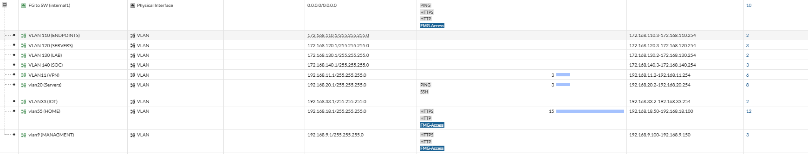
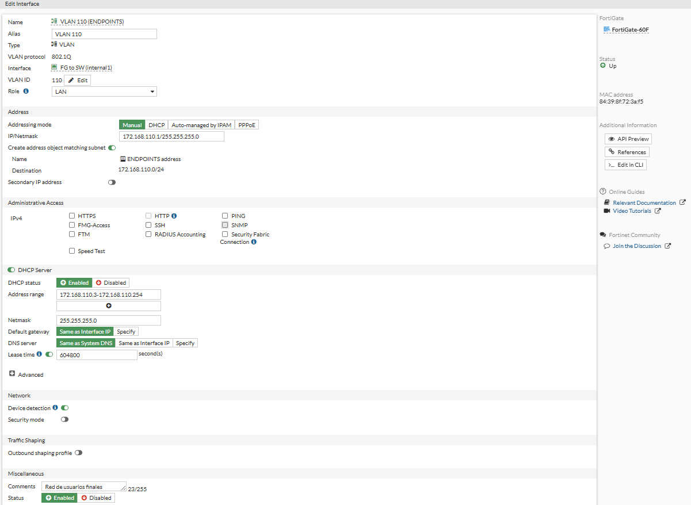
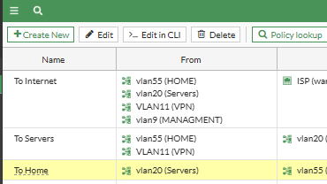

# 🔥 FortiGate - Network & Firewall Configuration

## 🎯 Objetivo

Configurar el firewall FortiGate como punto central de control de red, encargado de la segmentación mediante VLANs, control de tráfico, acceso a Internet y generación de logs para el SIEM.

---

## 🧱 Entorno

- Dispositivo: FortiGate 60F  
- Rol: Firewall perimetral y gateway  
- Interfaces:
  - WAN1 → Internet  
  - Internal → Switch (trunk VLANs)  

### 🌐 VLANs configuradas

| VLAN | Nombre       | Red                | Gateway        |
|------|------------|--------------------|----------------|
| 9    | MANAGEMENT | 192.168.9.0/24     | 192.168.9.1    |
| 110  | ENDPOINTS  | 172.168.110.0/24   | 172.168.110.1  |
| 120  | SERVERS    | 172.168.120.0/24   | 172.168.120.1  |
| 130  | LAB        | 172.168.130.0/24   | 172.168.130.1  |
| 140  | SOC        | 172.168.140.0/24   | 172.168.140.1  |

---

## ⚙️ Configuración

### 1. Creación de VLANs

Se crean interfaces virtuales sobre la interfaz interna para segmentar la red.

---

### 2. Configuración de DHCP

Se habilita DHCP por cada VLAN para asignación automática de direcciones IP.

---

### 3. Políticas de firewall

Se configuran políticas para controlar el tráfico entre VLANs:

- ENDPOINTS → Internet (Permitido)  
- SERVERS → Internet (Permitido)  
- LAB → Restricción hacia SERVERS  
- SOC → Acceso a todas las redes (monitoreo)  

---

### 4. NAT y salida a Internet

- Se habilita NAT en políticas de salida  
- Tráfico interno traducido hacia WAN  

---

### 5. Segmentación de red

Se implementa separación lógica entre redes:

- Usuarios (Endpoints)  
- Servidores  
- Laboratorio (entorno vulnerable)  
- SOC (monitoreo)  

---

## 📸 Evidencia

- VLANs operativas  
- Equipos obteniendo IP por DHCP  
- Acceso a Internet funcional  
- Tráfico restringido entre VLANs  

---

## ✅ Validación

- Ping entre hosts según políticas definidas  
- Bloqueo de tráfico no permitido (ej: LAB → SERVERS)  
- Acceso a Internet desde VLANs autorizadas  
- Gateway respondiendo correctamente  

---

## 🔐 Consideraciones de seguridad

- Segmentación de red para reducir superficie de ataque  
- Restricción de acceso entre VLANs críticas  
- Uso del firewall como punto central de inspección  
- Posible integración futura con IDS/IPS  

---

## 📊 Logs y monitoreo (SOC)

El FortiGate genera eventos relevantes para el SIEM:

- Conexiones permitidas y bloqueadas  
- Tráfico entre VLANs  
- Accesos sospechosos  
- Eventos de red  

👉 Estos logs serán enviados a Wazuh para análisis y correlación.

---

## 🧠 Notas

- El tráfico entre VLANs pasa obligatoriamente por el firewall  
- La red LAB se mantiene aislada para pruebas de ataque  
- SOC tiene visibilidad sobre todas las redes  

---

## 🔗 Relación con el SOC

El FortiGate es un componente crítico para el SOC:

- Controla el flujo de tráfico  
- Permite aplicar políticas de seguridad  
- Genera logs para detección de amenazas  
- Facilita la identificación de comportamientos anómalos  
