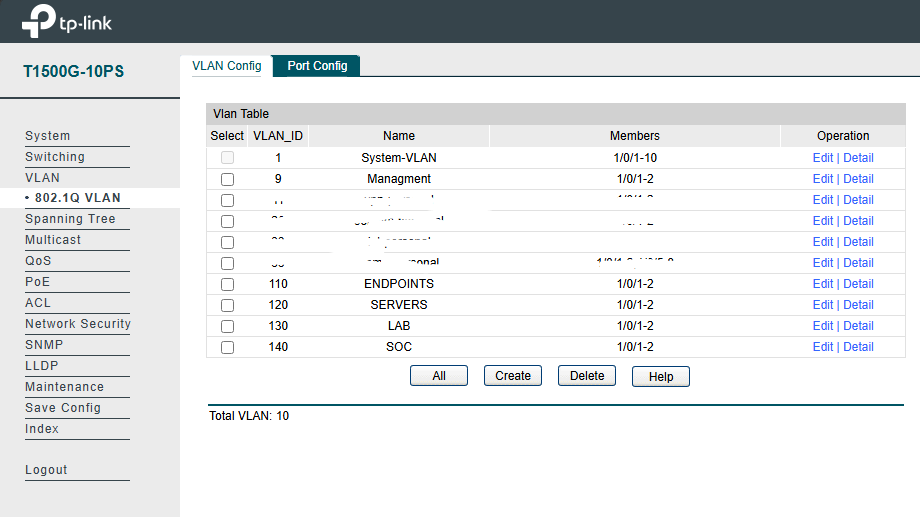
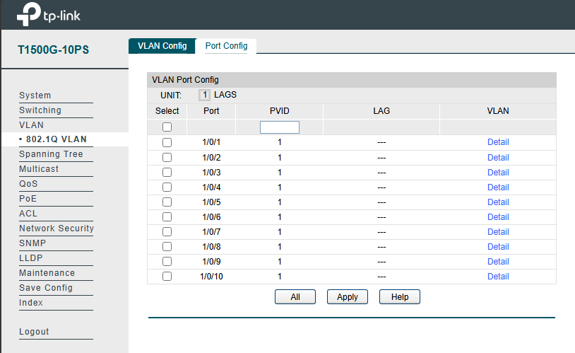

# 🔌 Switch - VLAN & Network Configuration

## 🎯 Objetivo

Configurar el switch para soportar la segmentación de red mediante VLANs y permitir la correcta comunicación entre el firewall (FortiGate) y el hypervisor (Proxmox).

---

## 🧱 Entorno

- Modelo: TP-Link T1500G-10PS
- Rol: Distribución de red
- Conexiones:
  - FortiGate → Trunk (VLANs)
  - Proxmox → Trunk (VLANs)
  - Dispositivos finales → Access (según VLAN)

---

## 🌐 VLANs configuradas

| VLAN | Nombre       | Uso                |
|------|-------------|-------------------|
| 9    | MANAGEMENT  | Administración     |
| 110  | ENDPOINTS   | Usuarios finales   |
| 120  | SERVERS     | Infraestructura    |
| 130  | LAB         | Entorno vulnerable |
| 140  | SOC         | Monitoreo SIEM     |

---

## ⚙️ Configuración

### 1. Creación de VLANs

Se crean las VLANs necesarias para segmentar la red.

---

### 2. Configuración de puertos

#### 🔗 Puerto hacia FortiGate
- Modo: Trunk  
- VLANs permitidas: Todas  

#### 🔗 Puerto hacia Proxmox
- Modo: Trunk  
- VLANs permitidas: Todas  

#### 💻 Puertos de acceso
- Asignación según necesidad:
  - VLAN 110 → Usuarios
  - VLAN 120 → Servidores

---

### 3. Etiquetado de VLAN (802.1Q)

Se utiliza etiquetado VLAN para transportar múltiples redes sobre un mismo enlace físico.

---

## 📸 Evidencia

- VLANs creadas correctamente  
- Puertos configurados como trunk/access  
- Tráfico segmentado funcionando  

---

## ✅ Validación

- Dispositivos reciben IP de su VLAN correspondiente  
- Comunicación solo permitida según políticas del firewall  
- Tráfico correctamente etiquetado  

---

## 🔐 Consideraciones de seguridad

- Separación lógica de redes mediante VLANs  
- Reducción de broadcast innecesario  
- Base para control de acceso a nivel de firewall  

---

## 🧠 Notas

- El switch no filtra tráfico, solo lo transporta  
- El control de seguridad se realiza en el FortiGate  
- Es esencial para mantener la segmentación de red  

---

## 🔗 Relación con el SOC

El switch permite:

- Transporte de tráfico segmentado  
- Integración entre firewall y sistemas  
- Soporte para la arquitectura de red del SOC  

Sin esta configuración, no sería posible implementar segmentación ni monitoreo efectivo.
